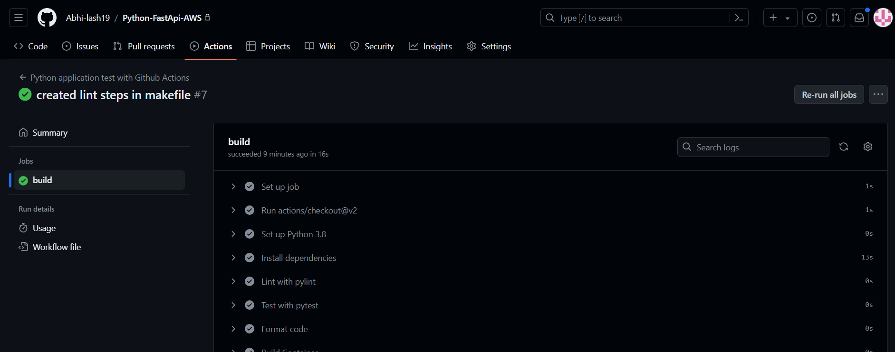

# Python-FastApi-AWS
This is a repository of my new Project where i will be working with Python , FastApi , AWS, and other DevOps Tool

1. Create a Python Virtual Environment `python3 -m venv ~/.venv` or `virtualenv ~/.venv`
2. Create empty files: `Makefile`, `requirements.txt`, `main.py`, `Dockerfile`, `mylib/__init__.py`,`mylib/logic.py`
3. Populate `Makefile`
4. Setup Continuous Integration, i.e. check code for issues like lint errors

5. Build cli using Python Fire library  `./cli-fire.py wiki --help` to test logic example `./cli-fire.py wiki --length 10`

